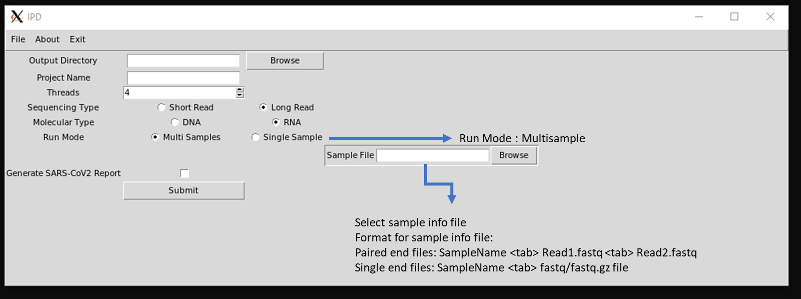
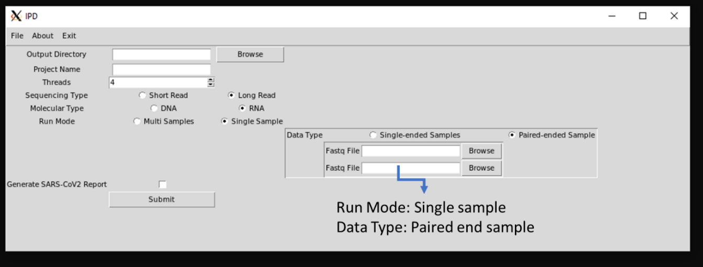
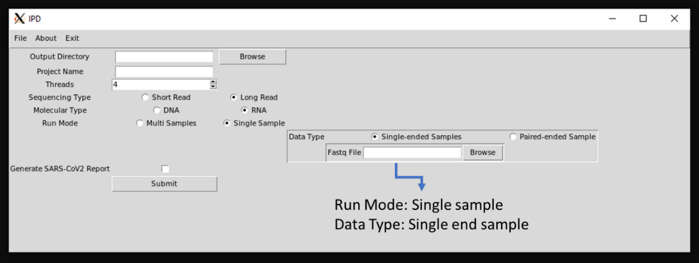

# IPD 2.0 (Infection Pathogen Detector2)

IPD 2.0 (an updated version of [Infectious Pathogen Detector2](https://github.com/sanket-desai/InfectiousPathogenDetector)) is an in-silico GUI-based automated pathogen analysis pipeline for seamless analysis of data from heterogeneous NGS platforms. IPD2 performs integrated variants analysis, along with systematic quantification of pathogen genomes. IPD2 additionally has an in-built SARS-CoV-2 analysis module, for assignment of viral clades of the samples analyzed and to generate an automated report.

## Getting Started

### Prerequisites required for installation of IPD 2.0

IPD 2.0 is developed using python3.

**System Prerequisites:**

  - [Conda](https://docs.conda.io/projects/conda/en/latest/user-guide/install/)

With the following system prerequisites in place, users can use the following commands in the Linux / Unix environment to install the required python packages.

### Installation

IPD 2.0 can be downloaded from [http://www.actrec.gov.in/pi-webpages/AmitDutt/IPD/IPD.html][PlDb]. Untar the downloaded tar.gz file using the following command:
```
tar xvzf ipd2.tar.gz
cd ipd2
```
The pre-build reference files need to be downloaded from here: http://ipd.actrec.gov.in/referencedatabase/data.tar.gz . Place the data.gz in the IPD2 home directory (ipd2) and unzip is using the following command:
```
tar xvzf data.tar.gz
```
Make sure that the complete 'untarred' data directory is present in the ipd2 home directory before proceeding with the further installation and running IPD 2.0.
In the home directory of IPD2 (ipd2), run the following command:

```
conda env create -f ipdenv.yml
```
This installs all the dependencies and tools required to run IPD 2.0.
Please note: Make sure you do not have the tools such as Blast, Hisat2, Subread / FeatureCounts, minimap2 added in the PATH variable. The tools on the host machine (when in PATH) are prioritized in usage when compared to the once present in the Conda environment.

For running any script pertaining to IPD 2.0, make sure that the IPD Conda environment is activated. More information about Conda environments can be found [here](https://docs.conda.io/projects/conda/en/latest/user-guide/tasks/manage-environments.html).

**Adding pathogens of choice to IPD 2.0 database**

We understand that users of IPD may want to include additional pathogen genomes, to perform the quantification and variant calling from the NGS data. Hence, we provide an additional script ("ipdupdatedb.py") along with the core IPD package. To update the current primary pathogen database, a user is required to either download and give the pathogen genome as a flat file in the GenBank format (single or multiple genomes are accepted) or provide a list of GenBank IDS in a text file (one ID per line), which would be downloaded automatically and the database is updated accordingly. The usage of the update script is described in the snapshot below.

**Command:**

```
$ python3 ipdupdatedb.py -f <format> -i <input file>
```


### Running IPD 2.0

The required scripts to run IPD 2.0 are placed in the “src” directory of IPD. IPD can be run in two modes; command line (ipd_cli.py) or the GUI mode (ipd_gui.py). By going into the /src directory of ipd2, users can run the program as shown below:

**For Command Line interface:**

```
$ python3 ipd_cli.py
```

**For GUI: **

```
$ python3 ipd_gui.py
```

### Guide to use command-line interface of IPD 2.0

Scripts are present in the src folder. src should be used as the execution directory, output directory will be used as the working directory. The screen-shot below explains the options available in the interface and its usage. There are two modes in the IPD command-line interface based on the sequencing type selected (long read sequencing and short read sequencing)

**Command:**

```
$ python3 ipd_cli.py {long, short}
```


Single-end long read data is taken as an input. Prefix is set as the project name which is used as the prefix for all the output files.

**Command:**

```
$ python3 ipd_cli.py long -p <Project Name> -t <number of threads default 4> -m <DNA/RNA> -o <output directory> -i <input fastq/fastq.gz file with path>
```


Paired-end and single-end data can be given as input in case of short read sequenced input files. Files should be given with complete path. In case of paired end data, files should be given with a space in between.

**Command:**

```
$ python3 ipd_cli.py short -p <project name> -t <number of threads default 4> -o <output directory> -m <DNA/RNA> -i <input fastq or fastq.gz file/files>
```


### Guide to use GUI of IPD 2.0

IPD 2.0 graphical user interface is developed for the analysis of both long and short read to detect the abundance of pathogen and variants present in them. GUI code is kept in src, following command is used to access the same.

```
$python3 ipd_gui.py
```


It has both multi-sample and single sample run mode. For Multi-sample run mode, user need to provide a sample info file. Sample name and Project name will be used as prefix for all the output files.  

**Example Sample File format for paired-end data:**

SampleName <tab> testfile_r1.fastq.gz <tab> testfile_r2.fastq.gz

**Example Sample File format for single-end data:**

SampleName <tab> testfile_r1.fastq.gz



For Single sample run mode there is further two options for the data type, paired-end and single-end. It enables the user to browse the fastq/fastq.gz input files. Project name will be used as the prefix for all the output files in this case.






### SARS-CoV2 report generation

SARS-Cov2 report generation script enables to user to visualize the coverage and expression of SARS-CoV2 in the sample. Further it provides a detailed summary of the reads, and assign clades based on the SARS-CoV2 variant profile. It required the output directory post IPD run. The code accesses the required files and generate a HTML report in the same output directory as Output.html (Refer Page 6 of 6 for sample IPD report)

**Command:**

```
$python3 cov2reportgenerator.py -dir <output directory>
```


### IPD output

Sample HTML Report is attached below.

It has four Sections:

1.	Basic Alignment Statistical summary: It includes total reads, aligned reads and read length of each sample in the project.
2.	Per Base Coverage for SARS-CoV2: The read depth of each base of SARS-CoV2 genome is calculated and log2 of the reads is taken and sample-wise plots are generated
3.	Relative Abundance: Stack-bar plot illustrates the relative abundance of Human, Pathogen, SARS-CoV2 and unaligned reads for each sample. The FPKM values of SARS-CoV2 are plotted in the adjacent bar plot.
4.	Novel SARS-CoV2 Variants: Annotated variants not present in the IPD SARS-CoV2 vcf-database used are tabulated.
5.	Variant Based SARS-CoV2 Clade Assignment: Based on the mutational profile of the sample’s clade assessment is done and tabulated in the last section of the report.

Apart from the HTML SARS-CoV2 report, IPD generates other tabulated output which are as follow:

1.	Finalcount.tsv: it contains raw feature counts, length and FPM (Fragment per million) of all 1060 pathogen included in the database.
2.	Final_anno.vcf: It contains the annotated variants for all the pathogens present in database.
3.	Sample_assembledcontigs/ final.contigs.fa: It contains the assembled Contigs


